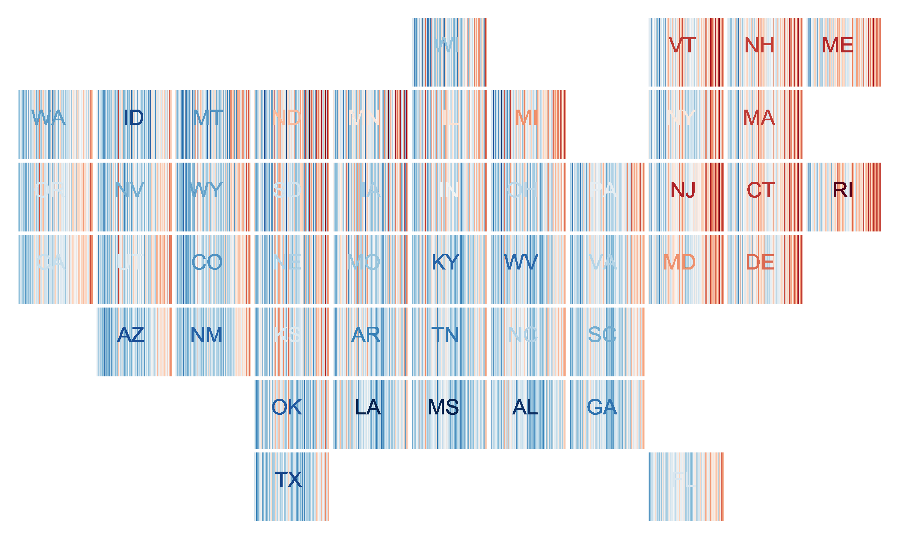
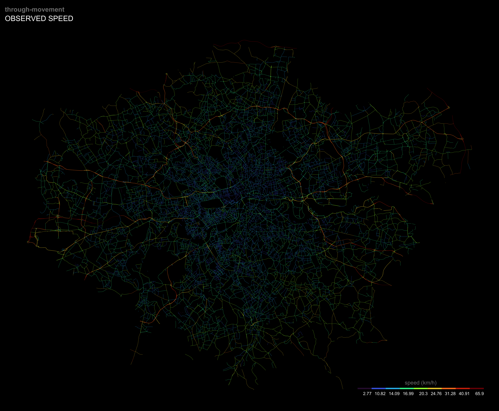

# tinkering
### musing, testing, experimenting—learning by doing

This folder collects a number of quick-and-dirty projects that were too trivial to give a repository. Many begin as graphics for the classes my lab teaches at Wharton, which devote considerable time to the origin and purpose of cities.  

